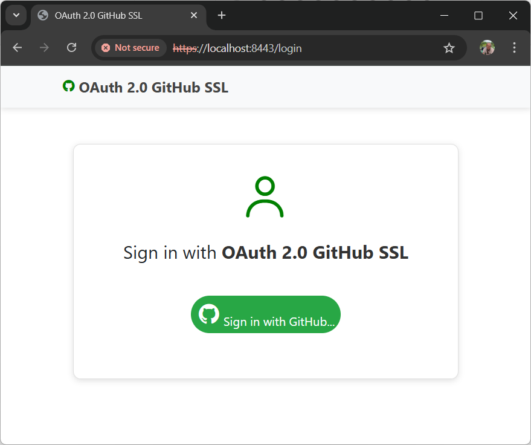

# OAuth 2.0 GitHub SSL 

[](https://en.wikipedia.org/wiki/Self-signed_certificate)
[](https://docs.github.com/en/rest)
[](https://oauth.net/2/)
[](<https://spring.io/projects/spring-boot>) 
[](https://gradle.org/)
[](https://www.thymeleaf.org/)
[](https://www.sonarsource.com/products/sonarqube/)

### A Spring Boot web application configured to use OAuth 2.0 with GitHub API and self-signed SSL certificate.




### Tech Stack
* 🔶 Java 21.0.5 LTS
* 🔶 Spring Boot 3.4.3
* 🔶 Gradle 8.12.1
* 🔶 Apache Tomcat 10.1.36
* 🔶 SonarQube 4.0.0.2929

### IDE
* 🔶 Visual Studio Code 1.98.2


#### What is OAuth 2.0?

OAuth (Open Authorization) 2.0 is an open authorization standard. It provides a way for users to log into a web-based
application (Spring Security OAuth 2.0) by delegating the authentication process to trusted third-party services, such
as Google and GitHub. The full specification of the OAuth 2.0 protocol can be found
in [RFC 6749](https://datatracker.ietf.org/doc/html/rfc6749).

#### How use OAuth2.0?

1. Clone a GitHub Repository to your computer:

          git clone https://github.com/AndrzejSzelag/oauth2githubssl.git

2. Configuring an **OAuth 2.0 GitHub SSL** application in **GitHub** (https://github.com/: Settings -> Developer settings).

   You need:

        CLIENT_ID
        CLIENT_SECRET

      **Warning:**
      These values should be set in the **application.yml** file in place of **CLIENT_ID** and **CLIENT_SECRET**.

###  Self-Signed SSL Configuration (Required for HTTPS)

This application uses a self-signed SSL certificate for development and testing purposes with HTTPS. Since the private key file (`keystore.p12`) is excluded from the repository (via `.gitignore` for security reasons), you must generate your own local key before running the application.

### 1. Generate the Keystore File

Execute the following command in the project's root directory. This requires **Java Development Kit (JDK)** to be installed, as it uses the `keytool` utility. 

```bash
keytool -genkeypair -alias oauth2githubssl-key -keyalg RSA -keysize 2048 -storetype PKCS12 -keystore src/main/resources/keystore.p12 -validity 3650
```

* **Crucial Step**: When prompted for **"First and last name"** (**What is your first and last name?**), you must enter **localhost**. This is required for the browser to trust the certificate for local development.

* **Password**: Use a secure password (e.g., ```haslo1234```) and remember it for the next step.

### 2. Configure the Application Properties
After generating the ```keystore.p12``` file, ensure your **src/main/resources/application.properties** (or **application.yml**) file contains the following configuration, making sure to replace the placeholder password with the one you chose during generation:

      server.port=8443
      server.ssl.enabled=true
      server.ssl.key-store-type=PKCS12
      server.ssl.key-store=classpath:keystore.p12
      server.ssl.key-store-password=haslo1234  # <--- REPLACE WITH YOUR PASSWORD
      server.ssl.key-alias=gym-key


### To run a Spring Boot project using Gradle from the command line, follow these steps:
* Open a terminal in the project's root directory.
* Execute the command:

          gradle bootRun
          
* Paste the URL into your web browser:

          http://localhost:8080


❤️ You have successfully run the Spring Boot project using Gradle!
